# SONiC SNMP — MIB Developer & Test Guide

> **Audience:** Engineers new to SNMP and/or SONiC who want to understand, test, and contribute to
> Interface, Entity, and Sensor MIB support on a Spectrum-4 based SONiC switch.
>
> **Platform:** Spectrum-4 / SONiC · **Enterprise PEN:** UpscaleAI `64820`  
> **Branch:** `thongal_nms_compliance1` · **Base commit:** `6bc7412`

---

## Table of Contents

1. [How SONiC Serves SNMP Data](#1-how-sonic-serves-snmp-data)
2. [Why pytest for MIB Validation](#2-why-pytest-for-mib-validation)
3. [Quick-Start: Environment Setup](#3-quick-start-environment-setup)
4. [Interface MIB — RFC 1213 / RFC 2863](#4-interface-mib--rfc-1213--rfc-2863)
5. [Entity MIB — RFC 2737](#5-entity-mib--rfc-2737)
6. [Entity Sensor MIB — RFC 3433](#6-entity-sensor-mib--rfc-3433)
7. [Running the Existing Unit Tests](#7-running-the-existing-unit-tests)
8. [How to Fill a Gap — Contributor Workflow](#8-how-to-fill-a-gap--contributor-workflow)

---

## 1. How SONiC Serves SNMP Data

### 1.1 Container architecture

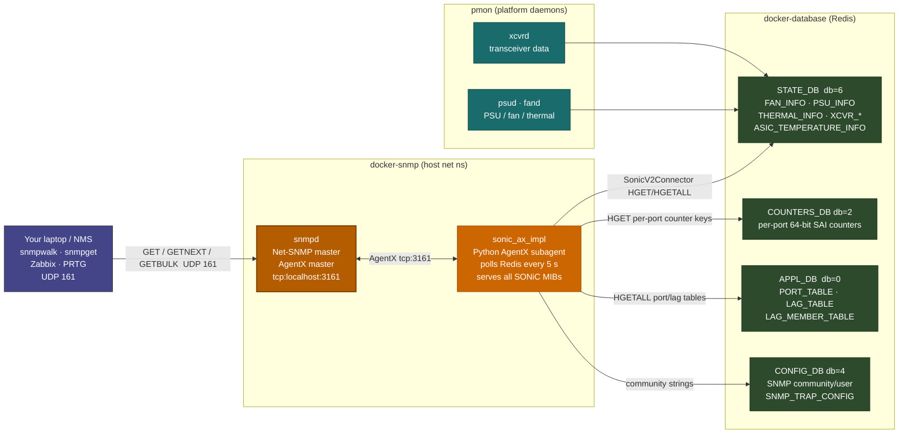

### 1.2 One GET request — end to end

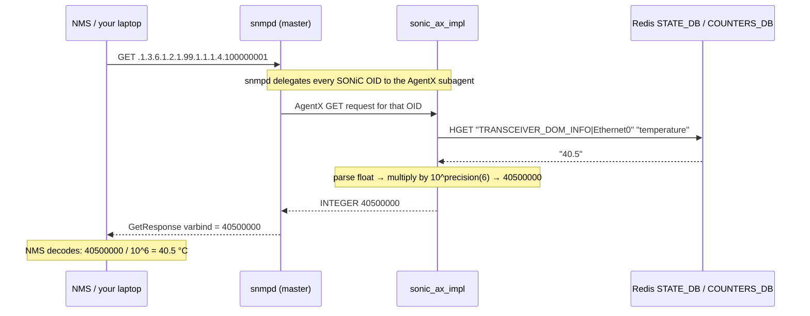

### 1.3 Workspace code map

```
sonic-snmpagent/
├── src/
│   ├── ax_interface/                         # Generic AgentX protocol (not MIB-specific)
│   │   ├── agent.py                          # Main loop, AgentX socket management
│   │   ├── mib.py                            # MIBMeta, SubtreeMIBEntry, OidMIBEntry
│   │   └── encodings.py                      # SNMP type encodings (Counter64, TimeTicks…)
│   └── sonic_ax_impl/
│       ├── main.py                           # Entry point — registers all MIBs
│       └── mibs/ietf/
│           ├── rfc1213.py          748 lines # Interface MIB (MIB-II ifTable)
│           ├── rfc2863.py          484 lines # Interface MIB (IF-MIB ifXTable)
│           ├── rfc2737.py         1177 lines # Entity MIB
│           ├── rfc3433.py          735 lines # Entity Sensor MIB
│           ├── sensor_data.py      281 lines # Sensor value decode helpers
│           └── physical_entity_sub_oid_generator.py  181 lines  # Index math
└── tests/
    ├── mock_tables/
    │   ├── dbconnector.py                    # Monkey-patches swsscommon with JSON fixtures
    │   ├── state_db.json                     # Fake STATE_DB (sensors, transceivers…)
    │   ├── counters_db.json                  # Fake COUNTERS_DB (port counters)
    │   └── appl_db.json                      # Fake APPL_DB (port/LAG tables)
    ├── test_rfc1213.py                       # Unit tests — Interface MIB (MIB-II)
    ├── test_rfc2863.py                       # Unit tests — Interface MIB (IF-MIB)
    ├── test_rfc2737.py                       # Unit tests — Entity MIB
    ├── test_rfc3433.py                       # Unit tests — Entity Sensor MIB
    ├── test_interfaces.py                    # Integration-style counter tests
    ├── test_hc_interfaces.py                 # 64-bit HC counter tests
    └── test_sensor.py                        # Sensor value / status tests
```

---

## 2. Why pytest for MIB Validation

### 2.1 The problem with "just snmpwalk"

When you run `snmpwalk` manually, you get a wall of text. You have to visually scan it, remember what good looks like, and notice when something changes. That doesn't scale — a Spectrum-4 chassis has hundreds of sensor OIDs, dozens of ports, and a full entity tree. Manual inspection misses regressions.

Traditional monitoring tools like Zabbix or Nagios tell you when a metric crosses a threshold, but they aren't designed to **verify correctness**:

```
snmpwalk can tell you:   ifOperStatus.3 = INTEGER: 2  (down)
snmpwalk cannot tell you:  Is this the right interface?
                            Did ifLastChange update when it went down?
                            Is the counter type Counter64 as required for 100G?
                            Are all expected sensor indices present?
```

pytest solves this by letting you **encode your expectations as executable assertions**.

### 2.2 How pytest works — the essentials

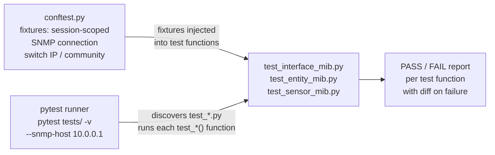

The three things you need to know:

| Concept | What it does | Why it matters for MIB testing |
|---|---|---|
| **fixture** | Shared setup code; runs once (session/module) or per-test (function) | One SNMP connection object reused across all tests — no reconnect overhead |
| **assert** | Fails the test with a diff if the condition is false | `assert int(val) in {1,2,3,4,5,6,7}` — one line catches all invalid `ifOperStatus` values |
| **parametrize** | Runs the same test with multiple inputs | Test all sensor indices in one function instead of one function per sensor |

### 2.3 Anatomy of a MIB test

```
tests/
├── conftest.py          ← fixtures: SNMP connection, switch IP, community string
├── snmp_util.py         ← helper: SnmpClient wrapping get/walk/bulk_walk
├── test_interface_mib.py
├── test_entity_mib.py
└── test_sensor_mib.py
```

```python
# conftest.py — session-scoped fixture means the SNMP connection is
# created ONCE and shared across all tests in the session
import pytest
from snmp_util import SnmpClient

def pytest_addoption(parser):
    parser.addoption("--snmp-host",  default="localhost")
    parser.addoption("--snmp-port",  default=161, type=int)
    parser.addoption("--community",  default="public")

@pytest.fixture(scope="session")          # ← created once, torn down after all tests
def snmp(request):
    return SnmpClient(
        host      = request.config.getoption("--snmp-host"),
        port      = request.config.getoption("--snmp-port"),
        community = request.config.getoption("--community"),
    )
```

```python
# snmp_util.py — thin wrapper so test code never deals with pysnmp boilerplate
from pysnmp.hlapi import (
    SnmpEngine, CommunityData, UdpTransportTarget, ContextData,
    ObjectType, ObjectIdentity, getCmd, nextCmd, bulkCmd,
)

class SnmpClient:
    def __init__(self, host, port=161, community="public"):
        self.engine    = SnmpEngine()
        self.community = CommunityData(community, mpModel=1)   # mpModel=1 → SNMPv2c
        self.transport = UdpTransportTarget((host, port), timeout=5, retries=2)
        self.context   = ContextData()

    def get(self, oid: str):
        err_ind, err_st, _, var_binds = next(
            getCmd(self.engine, self.community, self.transport,
                   self.context, ObjectType(ObjectIdentity(oid)))
        )
        if err_ind or err_st:
            raise RuntimeError(f"SNMP error: {err_ind or err_st}")
        return str(var_binds[0][0]), var_binds[0][1]

    def walk(self, oid: str) -> list:
        results = []
        for err_ind, err_st, _, vbs in nextCmd(
            self.engine, self.community, self.transport, self.context,
            ObjectType(ObjectIdentity(oid)), lexicographicMode=False
        ):
            if err_ind or err_st:
                raise RuntimeError(f"SNMP error: {err_ind or err_st}")
            results.extend((str(vb[0]), vb[1]) for vb in vbs)
        return results

    def bulk_walk(self, oid: str, max_rep=25) -> list:
        results = []
        for err_ind, err_st, _, vbs in bulkCmd(
            self.engine, self.community, self.transport, self.context,
            0, max_rep, ObjectType(ObjectIdentity(oid)), lexicographicMode=False
        ):
            if err_ind or err_st:
                raise RuntimeError(f"SNMP error: {err_ind or err_st}")
            results.extend((str(vb[0]), vb[1]) for vb in vbs)
        return results
```

### 2.4 The four test tiers for MIB validation

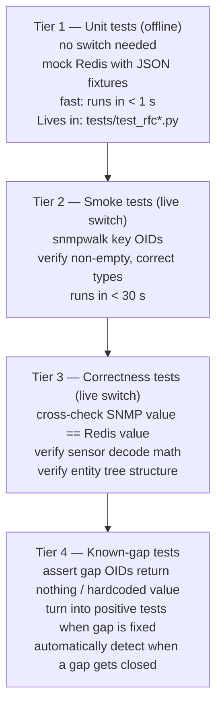

### 2.5 Running pytest

```bash
# Install dependencies (once)
pip install pysnmp pytest pytest-timeout

# Tier 1 — unit tests (no switch needed)
cd sonic-snmpagent
pip install -e ".[testing]"
pytest tests/test_rfc1213.py tests/test_rfc2863.py tests/test_rfc2737.py tests/test_rfc3433.py -v

# Tier 2-4 — live switch tests
pytest tests/ --snmp-host 10.0.0.1 --community public -v --timeout=30

# Run one MIB in isolation
pytest tests/test_entity_mib.py --snmp-host 10.0.0.1 -v

# Generate JUnit XML for CI
pytest tests/ --snmp-host 10.0.0.1 --junitxml=snmp_results.xml

# Coverage report
pytest tests/ --cov=src/sonic_ax_impl --cov-report=term-missing
```

---

## 3. Quick-Start: Environment Setup

### 3.1 Configure SNMP community on the switch

Edit `/etc/sonic/config_db.json`:

```json
{
    "SNMP": {
        "global": {
            "chassis_id": "Spectrum4-Switch01",
            "contact":    "ops@yourcompany.com",
            "location":   "Lab-Rack-01"
        }
    },
    "SNMP_COMMUNITY": {
        "public": { "name": "public", "vlan": "all" }
    }
}
```

```bash
sudo config reload -y
docker ps | grep snmp          # confirm container is running
```

### 3.2 Verify connectivity

```bash
# From your laptop
snmpget -v2c -c public <SWITCH_IP> .1.3.6.1.2.1.1.1.0     # sysDescr

# From inside the switch — bypasses ACL / firewall
docker exec -it snmp snmpwalk -v2c -c public localhost .1.3.6.1.2.1.1
```

### 3.3 Debug Redis directly when an OID looks wrong

```bash
# Always check Redis first — the subagent only reflects what is in the DB
docker exec -it database redis-cli -n 6 HGETALL "TRANSCEIVER_DOM_INFO|Ethernet0"
docker exec -it database redis-cli -n 6 HGETALL "PSU_INFO|PSU 1"
docker exec -it database redis-cli -n 6 HGETALL "FAN_INFO|FAN 1"
docker exec -it database redis-cli -n 6 HGETALL "THERMAL_INFO|ASIC"
docker exec -it database redis-cli -n 6 HGETALL "ASIC_TEMPERATURE_INFO"
```

---

## 4. Interface MIB — RFC 1213 / RFC 2863

### 4.1 What is this MIB?

The Interface MIB answers: **"What ports does this switch have, what state are they in, and how much traffic is flowing?"**

Every network port — physical Ethernet, LAG (PortChannel), loopback, management — is one row in `ifTable` / `ifXTable`. NMS platforms poll this MIB every 60–300 seconds to graph bandwidth, detect link failures, and trigger alerting workflows.

> **IETF standards**
> - [RFC 1213 — MIB-II (Management Information Base for Network Management of TCP/IP-based Internets)](https://www.rfc-editor.org/rfc/rfc1213)
> - [RFC 2863 — The Interfaces Group MIB (IF-MIB)](https://www.rfc-editor.org/rfc/rfc2863)
> - [IF-MIB module text (IETF)](https://www.ietf.org/rfc/rfc2863.txt)
> - [IANAifType-MIB — interface type registry (IANA)](https://www.iana.org/assignments/ianaiftype-mib/ianaiftype-mib)

### 4.2 MIB structure and OID layout

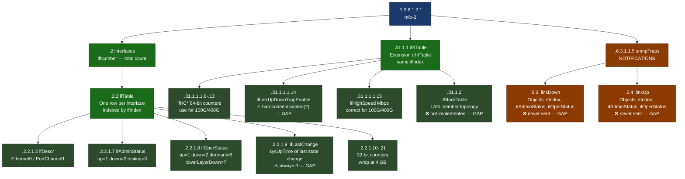

### 4.3 Notifications and alarms — the most important part for NMS

RFC 2863 defines two notifications that are **the primary mechanism for real-time link failure detection** in any NMS:

#### `linkDown` — OID `.1.3.6.1.6.3.1.1.5.3`

Sent when `ifOperStatus` transitions **into** `down` from any other state (except `notPresent`).

```
NOTIFICATION objects: ifIndex, ifAdminStatus, ifOperStatus
Varbind example:
  ifIndex.3        = INTEGER: 3
  ifAdminStatus.3  = INTEGER: 1  (admin up — meaning this is a fault, not a shutdown)
  ifOperStatus.3   = INTEGER: 2  (operationally down)
```

**Without this trap**, NMS must poll `ifOperStatus` every 60 seconds. A link that goes down and comes back up inside that poll window is invisible. With this trap, NMS gets notified within seconds.

#### `linkUp` — OID `.1.3.6.1.6.3.1.1.5.4`

Sent when `ifOperStatus` transitions **out of** `down` into any other state (except `notPresent`).

```
NOTIFICATION objects: ifIndex, ifAdminStatus, ifOperStatus
Used by NMS to: clear the active fault alarm, log recovery time
```

#### `ifLinkUpDownTrapEnable` — the gate

Per RFC 2863, traps are only generated for interfaces where this per-interface flag is `enabled(1)`. The default recommended by the RFC is:

> *"only the lowest sub-layer of the interface (the physical port) should generate traps by default."*

In SONiC today, **this is hardcoded `disabled(2)` for every interface**, so neither trap ever fires.

#### SONiC gap status

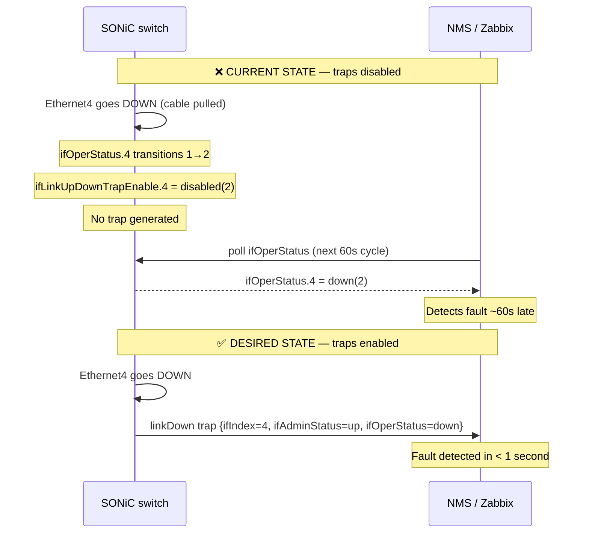

### 4.4 Data flow — where counters come from

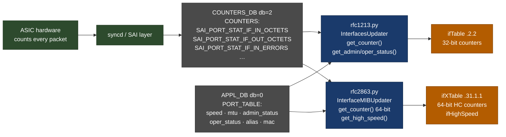

### 4.5 What is implemented today

| OID | Object | Value source | Status |
|---|---|---|---|
| `.2.2.1.2` | `ifDescr` | `PORT_TABLE:name` | ✅ |
| `.2.2.1.3` | `ifType` | Derived from name | ✅ `ethernetCsmacd(6)` / `propVirtual(53)` |
| `.2.2.1.4` | `ifMtu` | `PORT_TABLE mtu` | ✅ |
| `.2.2.1.5` | `ifSpeed` | 32-bit — **wraps at 4 Gbps; use ifHighSpeed for 100G+** | ✅ |
| `.2.2.1.6` | `ifPhysAddress` | `PORT_TABLE mac` | ✅ |
| `.2.2.1.7` | `ifAdminStatus` | `PORT_TABLE admin_status` | ✅ |
| `.2.2.1.8` | `ifOperStatus` | `PORT_TABLE oper_status` | ✅ |
| `.2.2.1.9` | `ifLastChange` | hardcoded `0` | ⚠️ GAP-IF-01 |
| `.2.2.1.10`–`.21` | `ifIn/Out*` 32-bit | `COUNTERS_DB` | ✅ |
| `.31.1.1.1.6`–`.13` | `ifHCIn/Out*` **64-bit** | `COUNTERS_DB` | ✅ **use these** |
| `.31.1.1.1.14` | `ifLinkUpDownTrapEnable` | hardcoded `disabled(2)` | ❌ GAP-IF-02 |
| `.31.1.1.1.15` | `ifHighSpeed` | `PORT_TABLE speed` Mbps | ✅ |
| `.31.1.1.1.16` | `ifPromiscuousMode` | hardcoded `true(1)` | ⚠️ GAP-IF-05 |
| `.31.1.1.1.17` | `ifConnectorPresent` | hardcoded `true(1)` | ⚠️ GAP-IF-06 |
| `.31.1.1.1.18` | `ifAlias` | `PORT_TABLE description` | ✅ |
| `.31.1.1.1.19` | `ifCounterDiscontinuityTime` | hardcoded `0` | ⚠️ GAP-IF-07 |
| `.31.1.2` | `ifStackTable` (LAG topology) | not implemented | ❌ GAP-IF-04 |
| mgmt0 counters | all 32-bit counter OIDs | hardcoded `0` | ❌ GAP-IF-03 |
| `linkDown` `.6.3.1.1.5.3` | trap | never sent | ❌ GAP-TRAP-01 |
| `linkUp` `.6.3.1.1.5.4` | trap | never sent | ❌ GAP-TRAP-01 |

### 4.6 Known gaps

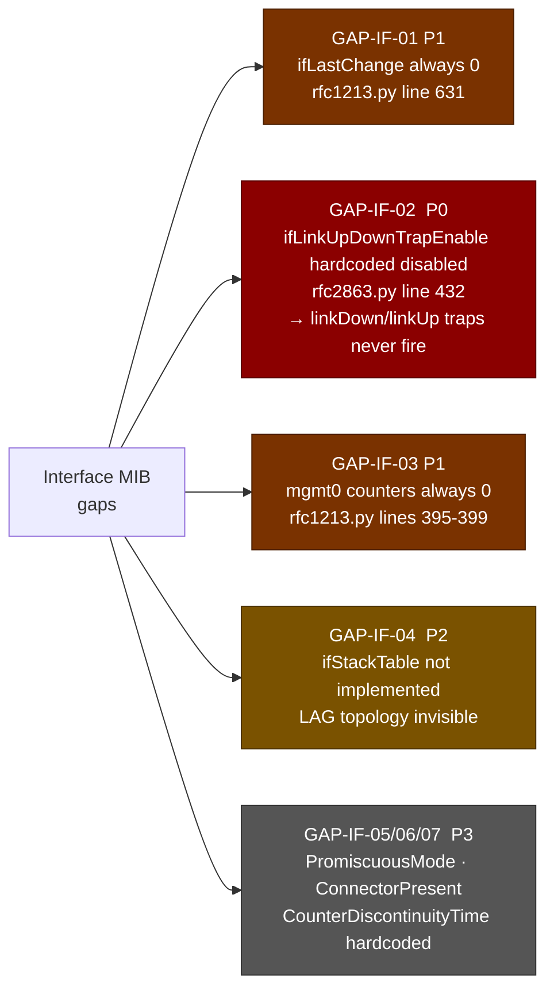

#### GAP-IF-01 — `ifLastChange` always 0

```bash
# Reproduce — all interfaces return Timeticks: (0) 0:00:00.00
snmpwalk -v2c -c public <SWITCH_IP> .1.3.6.1.2.1.2.2.1.9
```

```python
# rfc1213.py line 631
# FIXME Placeholder.
ifLastChange = SubtreeMIBEntry('2.1.9', if_updater, ValueType.TIME_TICKS, lambda sub_id: 0)
```

#### GAP-IF-02 — linkUp/linkDown traps never fire

```bash
snmpwalk -v2c -c public <SWITCH_IP> .1.3.6.1.2.1.31.1.1.1.14
# All return INTEGER: 2  (disabled)
```

```python
# rfc2863.py line 432
ifLinkUpDownTrapEnable = SubtreeMIBEntry('1.1.14', if_updater, ValueType.INTEGER, lambda sub_id: 2)
```

#### GAP-IF-03 — Management interface counters always 0

```bash
snmpwalk -v2c -c public <SWITCH_IP> .1.3.6.1.2.1.2.2.1.2 | grep -i eth
# Note the ifIndex of mgmt0 / eth0, then:
snmpwalk -v2c -c public <SWITCH_IP> .1.3.6.1.2.1.2.2.1.10  # all 0
```

```python
# rfc1213.py lines 395-399
if oid in self.mgmt_oid_name_map:
    # TODO: mgmt counters not available through SNMP right now
    return 0
```

### 4.7 pytest tests for Interface MIB

```python
# tests/test_interface_mib.py  — live switch tests
import pytest
from pysnmp.proto.rfc1902 import Counter64

IF_OPER_STATUS    = "1.3.6.1.2.1.2.2.1.8"
IF_LAST_CHANGE    = "1.3.6.1.2.1.2.2.1.9"
IF_HC_IN_OCTETS   = "1.3.6.1.2.1.31.1.1.1.6"
IF_HIGH_SPEED     = "1.3.6.1.2.1.31.1.1.1.15"
IF_LINK_TRAP_EN   = "1.3.6.1.2.1.31.1.1.1.14"
IF_STACK_TABLE    = "1.3.6.1.2.1.31.1.2"

def test_if_oper_status_valid_values(snmp):
    """Every ifOperStatus must be one of the RFC 2863 valid integers."""
    rows = snmp.walk(IF_OPER_STATUS)
    assert rows, "ifTable is empty — no interfaces found"
    for oid, val in rows:
        assert int(val) in {1,2,3,4,5,6,7}, \
            f"Invalid ifOperStatus {val} at {oid} (RFC 2863 allows 1–7)"

def test_hc_counters_are_counter64_type(snmp):
    """64-bit HC counters must be type Counter64, not Integer32."""
    rows = snmp.walk(IF_HC_IN_OCTETS)
    assert rows, "ifHCInOctets table is empty"
    for oid, val in rows:
        assert isinstance(val, Counter64), \
            f"Expected Counter64 at {oid}, got {type(val).__name__} — 32-bit counter on 100G+ port?"

def test_high_speed_at_least_one_nonzero(snmp):
    speeds = [int(v) for _, v in snmp.walk(IF_HIGH_SPEED)]
    assert any(s > 0 for s in speeds), "All ifHighSpeed values are 0"

def test_if_last_change_known_gap(snmp):
    """GAP-IF-01: ifLastChange always returns 0. Update this test when fixed."""
    for oid, val in snmp.walk(IF_LAST_CHANGE):
        assert int(val) == 0, \
            f"ifLastChange={val} at {oid} — gap may be fixed! Update test."

def test_link_trap_enable_known_gap(snmp):
    """GAP-IF-02: ifLinkUpDownTrapEnable hardcoded disabled(2). Update when fixed."""
    for oid, val in snmp.walk(IF_LINK_TRAP_EN):
        assert int(val) == 2, \
            f"ifLinkUpDownTrapEnable={val} at {oid} — traps now enabled? Update test."

def test_if_stack_table_known_gap(snmp):
    """GAP-IF-04: ifStackTable not implemented."""
    rows = snmp.walk(IF_STACK_TABLE)
    assert len(rows) == 0, f"ifStackTable now returns {len(rows)} rows — gap may be fixed!"
```

### 4.8 Development and test files

| File | Purpose |
|---|---|
| `src/sonic_ax_impl/mibs/ietf/rfc1213.py` | `InterfacesUpdater` — reads `APPL_DB` + `COUNTERS_DB`; defines `ifTable` OIDs |
| `src/sonic_ax_impl/mibs/ietf/rfc2863.py` | `InterfaceMIBUpdater` — extends with `ifXTable` (HC counters, `ifHighSpeed`, trap enable) |
| `tests/test_rfc1213.py` | Updater init, counter reads, Redis error handling |
| `tests/test_rfc2863.py` | HC counter types, speed reads |
| `tests/test_interfaces.py` | End-to-end counter values via mock DB |
| `tests/test_hc_interfaces.py` | 64-bit counter correctness |

```bash
pytest tests/test_rfc1213.py tests/test_rfc2863.py tests/test_interfaces.py tests/test_hc_interfaces.py -v
```

---

## 5. Entity MIB — RFC 2737

### 5.1 What is this MIB?

The Entity MIB answers: **"What physical hardware is installed in this switch, and how is it organised?"**

It exposes a tree of every physical component — chassis, fan drawers, fans, PSUs, transceivers, and line cards — as rows in `entPhysicalTable`. NMS platforms use this to build inventory databases, detect hardware add/remove events, and audit FRU serial numbers and firmware versions.

> **IETF standards**
> - [RFC 2737 — Entity MIB (Version 2)](https://www.rfc-editor.org/rfc/rfc2737)
> - [RFC 4133 — Entity MIB (Version 3 update)](https://www.rfc-editor.org/rfc/rfc4133)
> - [ENTITY-MIB module text (IETF)](https://www.ietf.org/rfc/rfc2737.txt)

**UpscaleAI vendor OID root (PEN 64820):**
Used in `entPhysicalVendorType` to identify UpscaleAI hardware parts:
`1.3.6.1.4.1.64820.1.1.4.<component_type>`

### 5.2 Physical entity tree

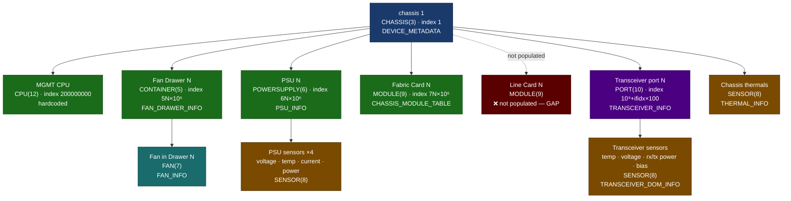

### 5.3 OID structure

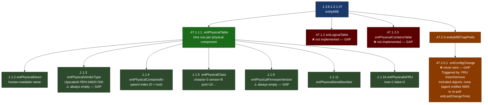

### 5.4 The most important notification — `entConfigChange`

`entConfigChange` is the **only notification defined by RFC 2737**. It is sent whenever the physical entity table changes — a PSU is inserted or removed, a transceiver is plugged in or pulled, a fan fails and is replaced.

**OID:** `.1.3.6.1.2.1.47.2.0.1`

```
entConfigChange NOTIFICATION-TYPE
    STATUS  current
    DESCRIPTION
        "An entConfigChange notification is generated when the value
         of entLastChangeTime changes. It can be utilized by an NMS
         to trigger logical/physical entity table maintenance polls.

         An agent should not generate more than one entConfigChange
         notification-event in a given time interval (five seconds
         is the suggested default)."
    ::= { entityMIBTrapPrefix 1 }
```

Key facts about `entConfigChange`:
- It carries **no objects** in its varbinds — it is purely a "go re-poll" signal
- The NMS is expected to re-read `entLastChangeTime` and then rescan `entPhysicalTable`
- RFC 2737 specifies a **5-second throttle** — multiple topology changes within 5s produce one notification
- **SONiC status:** Not implemented. Hardware add/remove events in `STATE_DB` are never turned into traps.

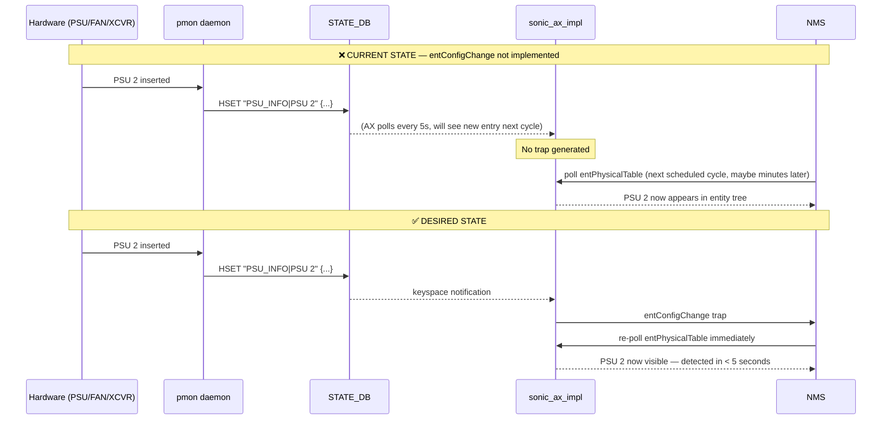

### 5.5 entPhysicalIndex scheme

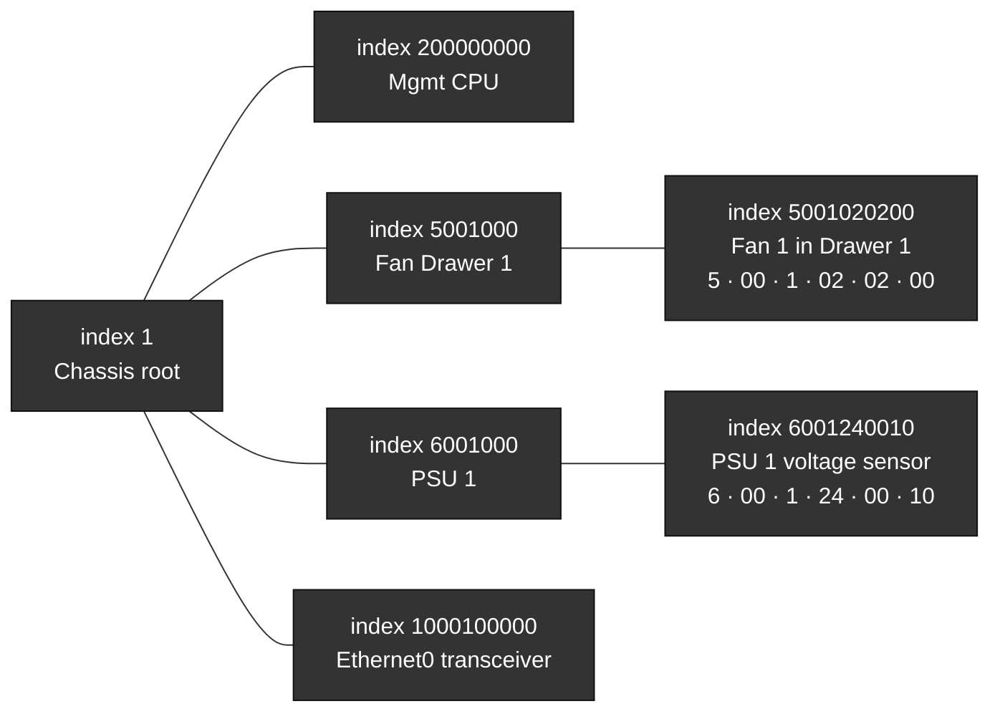

Index encoding (9 digits): `ModuleType(1) · ModuleIndex(2) · DeviceType(2) · DeviceIndex(2) · SensorType(1) · SensorIndex(1)`
— See `src/sonic_ax_impl/mibs/ietf/physical_entity_sub_oid_generator.py`

### 5.6 What is implemented today

| OID suffix | Object | Value source | Status |
|---|---|---|---|
| `1.1.1.2` | `entPhysicalDescr` | DB key description | ✅ |
| `1.1.1.3` | `entPhysicalVendorType` | Always `""` — PEN 64820 not wired | ❌ GAP |
| `1.1.1.4` | `entPhysicalContainedIn` | Parent index from name→OID map | ✅ |
| `1.1.1.5` | `entPhysicalClass` | chassis/fan/sensor/module/port enum | ✅ |
| `1.1.1.6` | `entPhysicalParentRelPos` | Slot position | ✅ |
| `1.1.1.7` | `entPhysicalName` | DB key name | ✅ |
| `1.1.1.8` | `entPhysicalHardwareVersion` | `vendor_rev` from TRANSCEIVER_INFO | ✅ |
| `1.1.1.9` | `entPhysicalFirmwareVersion` | Always `""` | ❌ GAP |
| `1.1.1.10` | `entPhysicalSoftwareRevision` | Always `""` | ❌ GAP |
| `1.1.1.11` | `entPhysicalSerialNumber` | PSU / FAN / XCVR info | ✅ |
| `1.1.1.12` | `entPhysicalMfgName` | Manufacturer | ✅ |
| `1.1.1.13` | `entPhysicalModelName` | Part number | ✅ |
| `1.1.1.14` | `entPhysicalAlias` | Always `""` | ⚠️ |
| `1.1.1.15` | `entPhysicalAssetID` | Always `""` | ⚠️ |
| `1.1.1.16` | `entPhysicalIsFRU` | `is_replaceable` | ✅ |
| `1.3.3` | `entPhysicalContainsTable` | Not implemented | ❌ GAP |
| `1.2` | `entLogicalTable` | Not implemented | ❌ GAP |
| `entConfigChange` `.47.2.0.1` | trap | Never sent | ❌ GAP |

### 5.7 pytest tests for Entity MIB

```python
# tests/test_entity_mib.py — live switch tests
import pytest

ENT_PHYS_DESCR      = "1.3.6.1.2.1.47.1.1.1.1.2"
ENT_VENDOR_TYPE     = "1.3.6.1.2.1.47.1.1.1.1.3"
ENT_CONTAINED_IN    = "1.3.6.1.2.1.47.1.1.1.1.4"
ENT_PHYS_CLASS      = "1.3.6.1.2.1.47.1.1.1.1.5"
ENT_FW_VERSION      = "1.3.6.1.2.1.47.1.1.1.1.9"
ENT_SERIAL          = "1.3.6.1.2.1.47.1.1.1.1.11"
ENT_IS_FRU          = "1.3.6.1.2.1.47.1.1.1.1.16"
ENT_CONTAINS_TABLE  = "1.3.6.1.2.1.47.1.3.3"
CLASS_CHASSIS, CLASS_SENSOR = 3, 8

@pytest.fixture(scope="module")
def entity_table(snmp):
    return {int(o.split(".")[-1]): int(v) for o, v in snmp.walk(ENT_PHYS_CLASS)}

def test_chassis_exists_at_index_1(entity_table):
    assert entity_table.get(1) == CLASS_CHASSIS, "Chassis not at index 1"

def test_sensor_entities_present(entity_table):
    sensors = [idx for idx, cls in entity_table.items() if cls == CLASS_SENSOR]
    assert sensors, "No SENSOR(8) entities in entPhysicalTable"

def test_containment_chain_valid(snmp, entity_table):
    """Every entPhysicalContainedIn must point to an existing index, or be 0 (root)."""
    contained = {int(o.split(".")[-1]): int(v) for o, v in snmp.walk(ENT_CONTAINED_IN)}
    for idx, parent in contained.items():
        if parent != 0:
            assert parent in entity_table, \
                f"Entity {idx} containedIn={parent} which does not exist in entity table"

def test_fru_values_valid(snmp):
    for oid, val in snmp.walk(ENT_IS_FRU):
        assert int(val) in {1, 2}, f"Invalid isFRU={val} at {oid} (must be true=1 or false=2)"

def test_firmware_version_known_gap(snmp):
    """GAP-ENT-02: entPhysicalFirmwareVersion always empty. Update when fixed."""
    for oid, val in snmp.walk(ENT_FW_VERSION):
        assert str(val) == "", \
            f"Firmware version now populated at {oid}: '{val}' — gap may be fixed!"

def test_vendor_type_known_gap(snmp):
    """GAP-ENT-03: entPhysicalVendorType always empty — UpscaleAI PEN 64820 not wired."""
    for oid, val in snmp.walk(ENT_VENDOR_TYPE):
        assert str(val) == "", \
            f"VendorType now populated at {oid}: '{val}' — verify it matches PEN 64820 OID tree"

def test_contains_table_known_gap(snmp):
    """GAP-ENT-05: entPhysicalContainsTable not implemented."""
    rows = snmp.walk(ENT_CONTAINS_TABLE)
    assert len(rows) == 0, f"entPhysicalContainsTable now returns {len(rows)} rows — gap may be fixed!"
```

### 5.8 Development and test files

| File | Purpose |
|---|---|
| `src/sonic_ax_impl/mibs/ietf/rfc2737.py` | All entity updater classes: `XcvrCacheUpdater`, `PsuCacheUpdater`, `FanCacheUpdater`, `ThermalCacheUpdater`, `FabricCardCacheUpdater` |
| `src/sonic_ax_impl/mibs/ietf/physical_entity_sub_oid_generator.py` | Index arithmetic — how a component gets its `entPhysicalIndex` |
| `tests/test_rfc2737.py` | Updater init, exception handling, fabric card cache |
| `tests/test_psu.py` | PSU entity and sensor data |
| `tests/test_sensor.py` | Sensor entity field reads |

```bash
pytest tests/test_rfc2737.py tests/test_psu.py tests/test_sensor.py -v
```

---

## 6. Entity Sensor MIB — RFC 3433

### 6.1 What is this MIB?

The Entity Sensor MIB answers: **"What is the current reading for every sensor in the physical inventory?"**

It is an extension of Entity MIB. Every `SENSOR(8)` row in `entPhysicalTable` has a corresponding row in `entPhySensorTable` giving the live numeric reading — temperature, voltage, current, power, or fan speed.

RFC 3433 deliberately has **no built-in threshold notification mechanism**. Instead, the RFC recommends using the RMON Alarm/Events MIB (RFC 2819) for threshold-based alerting. The Cisco ENTITY-SENSOR-MIB extension adds `entSensorThresholdTable` and the `entSensorThresholdNotification` to fill this gap.

> **IETF standards**
> - [RFC 3433 — Entity Sensor Management Information Base (ENTITY-SENSOR-MIB)](https://www.rfc-editor.org/rfc/rfc3433)
> - [ENTITY-SENSOR-MIB module text (IETF)](https://www.ietf.org/rfc/rfc3433.txt)
> - [RFC 2819 — RMON Alarm and Events MIB](https://www.rfc-editor.org/rfc/rfc2819) *(recommended by RFC 3433 for threshold notifications)*

### 6.2 Sensor reading — full lifecycle

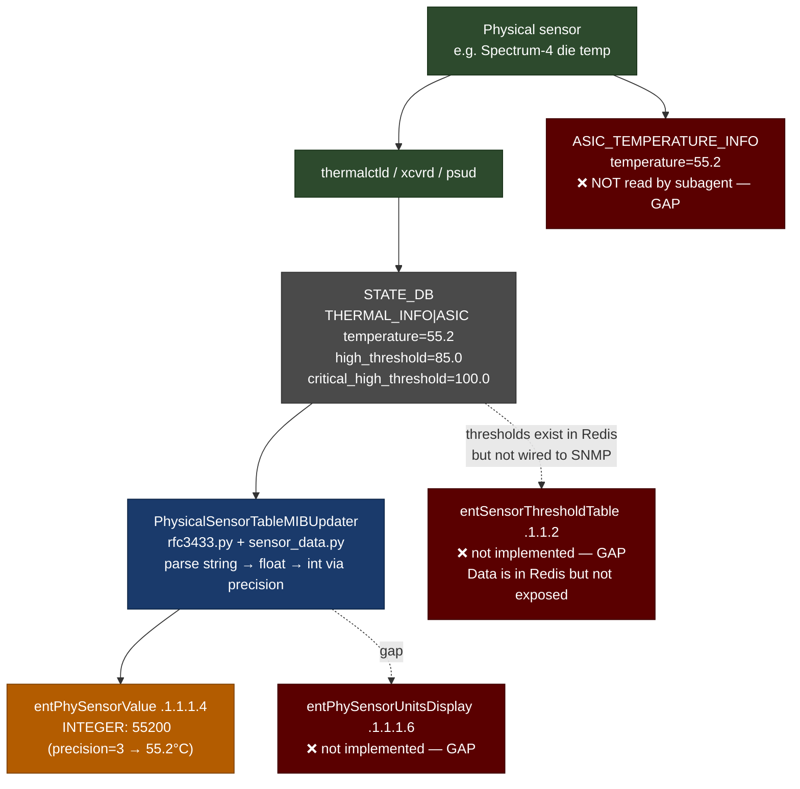

### 6.3 Sensor encoding — type, scale, precision

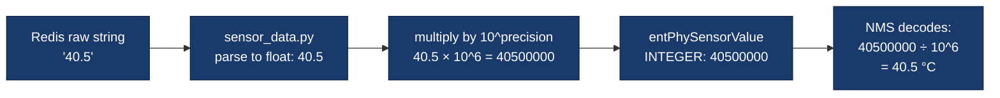

**Sensor type / scale / precision quick reference:**

| Sensor source | Redis table / key | TYPE int | SCALE int | PRECISION | Decode example |
|---|---|---|---|---|---|
| Transceiver temperature | `TRANSCEIVER_DOM_INFO\|EthernetN` → `temperature` | 8 (CELSIUS) | 9 (UNITS) | 6 | `40500000 → 40.5 °C` |
| Transceiver voltage | `TRANSCEIVER_DOM_INFO\|EthernetN` → `voltage` | 4 (VOLTS_DC) | 9 (UNITS) | 4 | `33000 → 3.3 V` |
| Transceiver RX power | `rx{n}power` (dBm → mW) | 6 (WATTS) | 8 (MILLI) | 4 | dBm converted to mW×10⁴ |
| Transceiver TX power | `tx{n}power` (dBm → mW) | 6 (WATTS) | 8 (MILLI) | 4 | same |
| Transceiver TX bias | `tx{n}bias` | 5 (AMPERES) | 8 (MILLI) | 3 | `7500 → 7.5 mA` |
| PSU temperature | `PSU_INFO\|PSU N` → `temp` | 8 (CELSIUS) | 9 (UNITS) | 3 | `40500 → 40.5 °C` |
| PSU voltage | `PSU_INFO\|PSU N` → `voltage` | 4 (VOLTS_DC) | 9 (UNITS) | 3 | `12000 → 12 V` |
| PSU current | `PSU_INFO\|PSU N` → `current` | 5 (AMPERES) | 9 (UNITS) | 3 | `5000 → 5 A` |
| PSU power | `PSU_INFO\|PSU N` → `power` | 6 (WATTS) | 9 (UNITS) | 3 | `60000 → 60 W` |
| Fan speed | `FAN_INFO\|FAN N` → `speed` | 10 (RPM) | 9 (UNITS) | 0 | `3600 → 3600 RPM` |
| Chassis thermal | `THERMAL_INFO\|<name>` → `temperature` | 8 (CELSIUS) | 9 (UNITS) | 3 | `55000 → 55 °C` |

### 6.4 OID structure and notification gap

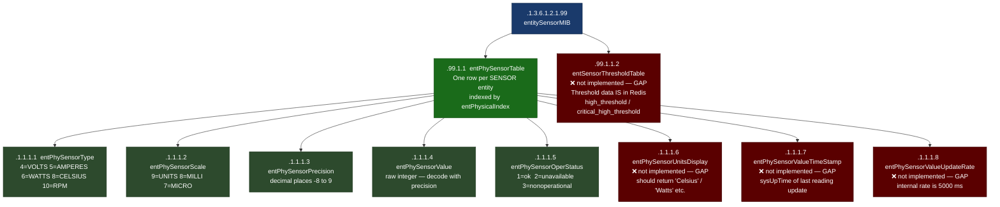

### 6.5 The threshold notification gap

RFC 3433 does not define threshold notifications itself. The RFC explicitly defers to **RMON (RFC 2819)** for this. Cisco extended the standard with:

- `CISCO-ENTITY-SENSOR-MIB` — adds `entSensorThresholdTable` and `entSensorThresholdNotification`
- SONiC uses `ciscoEntityFruControlMIB.py` for FRU health but **not** Cisco entity sensor thresholds

The thresholds exist in Redis today:

```bash
# These exist — they just aren't exposed via SNMP
docker exec -it database redis-cli -n 6 HGET "THERMAL_INFO|ASIC" "high_threshold"
docker exec -it database redis-cli -n 6 HGET "THERMAL_INFO|ASIC" "critical_high_threshold"
docker exec -it database redis-cli -n 6 HGET "PSU_INFO|PSU 1" "temp_threshold"
```

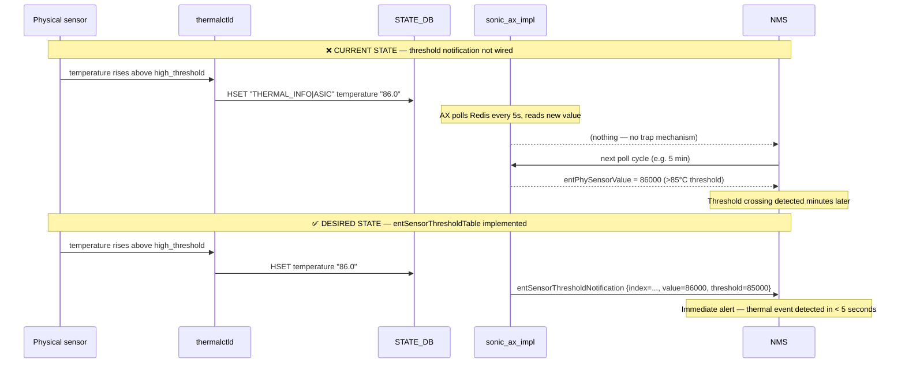

### 6.6 What is implemented today

| OID suffix | Object | Status |
|---|---|---|
| `1.1.1.1` | `entPhySensorType` | ✅ |
| `1.1.1.2` | `entPhySensorScale` | ✅ |
| `1.1.1.3` | `entPhySensorPrecision` | ✅ |
| `1.1.1.4` | `entPhySensorValue` | ✅ |
| `1.1.1.5` | `entPhySensorOperStatus` | ✅ `ok(1)` / `unavailable(2)` |
| `1.1.1.6` | `entPhySensorUnitsDisplay` | ❌ GAP-SENS-01 |
| `1.1.1.7` | `entPhySensorValueTimeStamp` | ❌ GAP-SENS-02 |
| `1.1.1.8` | `entPhySensorValueUpdateRate` | ❌ GAP-SENS-03 |
| `1.1.2` | `entSensorThresholdTable` | ❌ GAP-SENS-04 |
| ASIC temp | `ASIC_TEMPERATURE_INFO` mapping | ❌ GAP-SENS-05 |

### 6.7 pytest tests for Entity Sensor MIB

```python
# tests/test_sensor_mib.py — live switch tests
import pytest

SENSOR_TYPE       = "1.3.6.1.2.1.99.1.1.1.1"
SENSOR_SCALE      = "1.3.6.1.2.1.99.1.1.1.2"
SENSOR_PRECISION  = "1.3.6.1.2.1.99.1.1.1.3"
SENSOR_VALUE      = "1.3.6.1.2.1.99.1.1.1.4"
SENSOR_STATUS     = "1.3.6.1.2.1.99.1.1.1.5"
SENSOR_UNITS      = "1.3.6.1.2.1.99.1.1.1.6"
SENSOR_THRESHOLD  = "1.3.6.1.2.1.99.1.1.2"
ENT_PHYS_CLASS    = "1.3.6.1.2.1.47.1.1.1.1.5"
CLASS_SENSOR      = 8

CELSIUS, VOLTS_DC, AMPERES, WATTS, RPM = 8, 4, 5, 6, 10
UNITS_SCALE = 9
OK = 1

@pytest.fixture(scope="module")
def sensor_indices(snmp):
    return [int(o.split(".")[-1]) for o, _ in snmp.walk(SENSOR_TYPE)]

def test_sensor_table_not_empty(sensor_indices):
    assert sensor_indices, "entPhySensorTable is empty — no sensors visible via SNMP"

def test_sensor_indices_match_entity_class(snmp, sensor_indices):
    """Every sensor index in entPhySensorTable must be class SENSOR(8) in entPhysicalTable."""
    for idx in sensor_indices:
        _, cls = snmp.get(f"{ENT_PHYS_CLASS}.{idx}")
        assert int(cls) == CLASS_SENSOR, \
            f"Sensor index {idx} has class {cls} in entPhysicalTable, expected SENSOR(8)"

def test_sensor_type_in_valid_range(snmp, sensor_indices):
    """entPhySensorType must be 1–14 per RFC 3433 EntitySensorDataType."""
    for idx in sensor_indices:
        _, val = snmp.get(f"{SENSOR_TYPE}.{idx}")
        assert 1 <= int(val) <= 14, f"Sensor type {val} out of RFC range at index {idx}"

def test_sensor_precision_in_rfc_range(snmp, sensor_indices):
    """entPhySensorPrecision must be -8 to 9 per RFC 3433."""
    for idx in sensor_indices:
        _, val = snmp.get(f"{SENSOR_PRECISION}.{idx}")
        assert -8 <= int(val) <= 9, f"Precision {val} out of RFC range at index {idx}"

def test_sensor_value_within_int32_range(snmp, sensor_indices):
    for idx in sensor_indices:
        _, val = snmp.get(f"{SENSOR_VALUE}.{idx}")
        assert -1_000_000_000 <= int(val) <= 1_000_000_000, \
            f"Sensor value {val} out of EntitySensorValue range at index {idx}"

def test_celsius_sensors_reasonable_temperature(snmp, sensor_indices):
    """Temperature sensors reporting ok(1) should be between -10 and 120 °C."""
    for idx in sensor_indices:
        _, t  = snmp.get(f"{SENSOR_TYPE}.{idx}")
        _, sc = snmp.get(f"{SENSOR_SCALE}.{idx}")
        if int(t) != CELSIUS or int(sc) != UNITS_SCALE:
            continue
        _, st = snmp.get(f"{SENSOR_STATUS}.{idx}")
        if int(st) != OK:
            continue
        _, p = snmp.get(f"{SENSOR_PRECISION}.{idx}")
        _, v = snmp.get(f"{SENSOR_VALUE}.{idx}")
        actual = int(v) / (10 ** int(p))
        assert -10 <= actual <= 120, \
            f"Temperature {actual} °C out of sane range at sensor index {idx}"

def test_sensor_units_display_known_gap(snmp):
    """GAP-SENS-01: entPhySensorUnitsDisplay not implemented."""
    rows = snmp.walk(SENSOR_UNITS)
    assert len(rows) == 0, \
        f"entPhySensorUnitsDisplay now returns {len(rows)} entries — gap may be fixed!"

def test_sensor_threshold_table_known_gap(snmp):
    """GAP-SENS-04: entSensorThresholdTable not implemented.
    Note: threshold data exists in Redis (THERMAL_INFO high_threshold etc.)."""
    rows = snmp.walk(SENSOR_THRESHOLD)
    assert len(rows) == 0, \
        f"entSensorThresholdTable now returns {len(rows)} entries — gap may be fixed!"
```

### 6.8 Development and test files

| File | Purpose |
|---|---|
| `src/sonic_ax_impl/mibs/ietf/rfc3433.py` | `PhysicalSensorTableMIBUpdater` + `PhysicalSensorTableMIB` — all sensor OID registrations |
| `src/sonic_ax_impl/mibs/ietf/sensor_data.py` | `BaseSensorData` + per-type classes — parse raw Redis strings, apply type/scale/precision |
| `src/sonic_ax_impl/mibs/ietf/physical_entity_sub_oid_generator.py` | Sensor index constants (`SENSOR_TYPE_TEMP`, `SENSOR_TYPE_FAN` …) |
| `tests/test_rfc3433.py` | Updater init, missing transceiver info, Redis error, fabric card fan sensors |
| `tests/test_sensor.py` | Sensor value and status reads via mock DB |
| `tests/namespace/test_sensor.py` | Same tests in multi-ASIC namespace context |

```bash
pytest tests/test_rfc3433.py tests/test_sensor.py -v
```

---

## 7. Running the Existing Unit Tests

The unit test suite mocks Redis using JSON fixture files — **no switch hardware needed**.

```bash
cd sonic-snmpagent

# Install
pip install -e ".[testing]"

# All tests
pytest tests/ -v

# Three core MIB files only
pytest tests/test_rfc1213.py tests/test_rfc2863.py \
       tests/test_rfc2737.py tests/test_rfc3433.py -v

# With coverage
pytest tests/ --cov=src/sonic_ax_impl --cov-report=term-missing
```

### How the mocking works

```python
# tests/mock_tables/dbconnector.py — the key trick
# This file monkey-patches swsscommon.SonicV2Connector so that
# every HGET / HGETALL call returns data from the JSON fixture files
# instead of a real Redis server.

# So when rfc3433.py calls:
#   self.statedb.get("STATE_DB", "TRANSCEIVER_DOM_INFO|Ethernet0", "temperature")
# it actually reads from:
#   tests/mock_tables/state_db.json  →  "TRANSCEIVER_DOM_INFO|Ethernet0"  →  "temperature"
```

To add a new test scenario: add the fixture data to `tests/mock_tables/state_db.json` (or `counters_db.json` / `appl_db.json`), then write the test.

---

## 8. How to Fill a Gap — Contributor Workflow

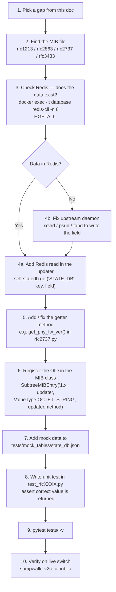

### Example: adding `entPhySensorUnitsDisplay` (GAP-SENS-01)

**Step 1** — Add getter in `PhysicalSensorTableMIBUpdater` (`rfc3433.py`):

```python
def get_ent_physical_sensor_units_display(self, sub_id):
    if sub_id not in self.sub_ids:
        return None
    sensor_type = self.ent_phy_sensor_type_map.get(sub_id)
    return {
        EntitySensorDataType.CELSIUS:  "Celsius",
        EntitySensorDataType.VOLTS_DC: "Volts DC",
        EntitySensorDataType.AMPERES:  "Amperes",
        EntitySensorDataType.WATTS:    "Watts",
        EntitySensorDataType.RPM:      "rpm",
    }.get(sensor_type, "")
```

**Step 2** — Register OID in `PhysicalSensorTableMIB` (`rfc3433.py`):

```python
entPhySensorUnitsDisplay = \
    SubtreeMIBEntry('1.6', updater, ValueType.OCTET_STRING,
                    updater.get_ent_physical_sensor_units_display)
```

**Step 3** — Unit test (`tests/test_rfc3433.py`):

```python
def test_units_display_celsius(self):
    updater = PhysicalSensorTableMIBUpdater()
    updater.sub_ids = {100000001}
    updater.ent_phy_sensor_type_map = {100000001: EntitySensorDataType.CELSIUS}
    assert updater.get_ent_physical_sensor_units_display(100000001) == "Celsius"

def test_units_display_unknown_index(self):
    updater = PhysicalSensorTableMIBUpdater()
    updater.sub_ids = set()
    assert updater.get_ent_physical_sensor_units_display(999) is None
```

**Step 4** — Verify on switch after deploying:

```bash
# Before fix: returns nothing
snmpwalk -v2c -c public <SWITCH_IP> .1.3.6.1.2.1.99.1.1.1.6

# After fix: should return e.g.:
# .1.3.6.1.2.1.99.1.1.1.6.100000001 = STRING: "Celsius"
# .1.3.6.1.2.1.99.1.1.1.6.200000001 = STRING: "Volts DC"
```

---

## Appendix — OID Quick Reference

| Object | OID |
|---|---|
| `sysDescr` | `.1.3.6.1.2.1.1.1.0` |
| `ifTable` | `.1.3.6.1.2.1.2.2` |
| `ifOperStatus` | `.1.3.6.1.2.1.2.2.1.8.{ifIndex}` |
| `ifLastChange` | `.1.3.6.1.2.1.2.2.1.9.{ifIndex}` |
| `ifXTable` | `.1.3.6.1.2.1.31.1.1` |
| `ifHCInOctets` | `.1.3.6.1.2.1.31.1.1.1.6.{ifIndex}` |
| `ifHCOutOctets` | `.1.3.6.1.2.1.31.1.1.1.10.{ifIndex}` |
| `ifHighSpeed` | `.1.3.6.1.2.1.31.1.1.1.15.{ifIndex}` |
| `ifLinkUpDownTrapEnable` | `.1.3.6.1.2.1.31.1.1.1.14.{ifIndex}` |
| `ifStackTable` | `.1.3.6.1.2.1.31.1.2` |
| `linkDown` trap | `.1.3.6.1.6.3.1.1.5.3` |
| `linkUp` trap | `.1.3.6.1.6.3.1.1.5.4` |
| `entPhysicalTable` | `.1.3.6.1.2.1.47.1.1.1` |
| `entPhysicalClass` | `.1.3.6.1.2.1.47.1.1.1.1.5.{index}` |
| `entPhysicalSerialNum` | `.1.3.6.1.2.1.47.1.1.1.1.11.{index}` |
| `entPhysicalFirmwareVersion` | `.1.3.6.1.2.1.47.1.1.1.1.9.{index}` |
| `entPhysicalVendorType` | `.1.3.6.1.2.1.47.1.1.1.1.3.{index}` |
| `entConfigChange` trap | `.1.3.6.1.2.1.47.2.0.1` |
| `entPhySensorTable` | `.1.3.6.1.2.1.99.1.1` |
| `entPhySensorValue` | `.1.3.6.1.2.1.99.1.1.1.4.{index}` |
| `entPhySensorOperStatus` | `.1.3.6.1.2.1.99.1.1.1.5.{index}` |
| `entPhySensorUnitsDisplay` | `.1.3.6.1.2.1.99.1.1.1.6.{index}` |
| `entSensorThresholdTable` | `.1.3.6.1.2.1.99.1.1.2` |

```bash
# Copy-paste one-liners
snmpwalk -v2c -c public <IP> .1.3.6.1.2.1.2.2.1.8         # all port states
snmpwalk -v2c -c public <IP> .1.3.6.1.2.1.31.1.1.1.6      # 64-bit RX bytes
snmpwalk -v2c -c public <IP> .1.3.6.1.2.1.47.1.1.1        # full entity tree
snmpwalk -v2c -c public <IP> .1.3.6.1.2.1.99.1.1.1.4      # all sensor values
snmpwalk -v2c -c public <IP> .1.3.6.1.2.1.99.1.1.1.5      # sensor op status
snmpbulkwalk -v2c -c public -Cn0 -Cr25 <IP> .1.3.6.1.2.1.99.1.1.1.4   # fast bulk

# From inside the container — no firewall/ACL issues
docker exec -it snmp snmpwalk -v2c -c public localhost .1.3.6.1.2.1.47.1.1.1
docker exec -it snmp snmpwalk -v2c -c public localhost .1.3.6.1.2.1.99.1.1.1
```

---

---

## References

### IETF Standards

| RFC | Title | Relevance |
|---|---|---|
| [RFC 1213](https://www.rfc-editor.org/rfc/rfc1213) | MIB-II | Defines `ifTable` (basic interface counters, admin/oper status) |
| [RFC 2863](https://www.rfc-editor.org/rfc/rfc2863) | The Interfaces Group MIB (IF-MIB) | `ifXTable`, 64-bit HC counters, `ifHighSpeed`, `linkUp/linkDown` traps |
| [RFC 2737](https://www.rfc-editor.org/rfc/rfc2737) | Entity MIB v2 | `entPhysicalTable`, `entConfigChange` trap |
| [RFC 4133](https://www.rfc-editor.org/rfc/rfc4133) | Entity MIB v3 | `entPhysicalContainsTable`, `entLastChangeTime` semantics |
| [RFC 3433](https://www.rfc-editor.org/rfc/rfc3433) | Entity Sensor MIB | `entPhySensorTable` — live sensor readings |
| [RFC 2819](https://www.rfc-editor.org/rfc/rfc2819) | RMON MIB | Alarm/Events groups — threshold notification mechanism deferred to here by RFC 3433 |
| [RFC 3418](https://www.rfc-editor.org/rfc/rfc3418) | SNMPv2-MIB | `coldStart`, `warmStart`, `authenticationFailure` standard traps |
| [RFC 3416](https://www.rfc-editor.org/rfc/rfc3416) | SNMPv2 Protocol Operations | GET, GETNEXT, GETBULK, SET PDU definitions |

### MIB Module Text

| MIB | Source |
|---|---|
| IF-MIB | <https://www.ietf.org/rfc/rfc2863.txt> |
| IANAifType-MIB (interface type registry) | <https://www.iana.org/assignments/ianaiftype-mib/ianaiftype-mib> |
| ENTITY-MIB | <https://www.ietf.org/rfc/rfc2737.txt> |
| ENTITY-SENSOR-MIB | <https://www.ietf.org/rfc/rfc3433.txt> |
| SNMPv2-MIB | <https://www.ietf.org/rfc/rfc3418.txt> |
| All IETF MIB modules | <https://mibs.ietf.org/> |

### Internal References

| Resource | Link |
|---|---|
| UpscaleAI SNMP landing page (PEN 64820, MIB support matrix, community string setup) | [Confluence — sw/206733324](https://bugatti-asic.atlassian.net/wiki/spaces/sw/pages/206733324/UpscaleAI+SNMP+landing+page) |
| sonic-snmpagent upstream | <https://github.com/sonic-net/sonic-snmpagent> |

### Source metadata

- **Commit:** `6bc7412` · **Branch:** `thongal_nms_compliance1`
- **UpscaleAI Enterprise PEN:** `64820` (`1.3.6.1.4.1.64820`)
- **RFC dates:** RFC 1213 (Mar 1991) · RFC 2863 (Jun 2000) · RFC 2737 (Dec 1999) · RFC 3433 (Dec 2002)
