# SONiC SNMP — MIB Developer & Test Guide

> **Audience:** Engineers new to SNMP and/or SONiC who want to understand, test, and contribute to
> Interface, Entity, and Sensor MIB support on a Spectrum-4 based SONiC switch.
>
> **Platform:** Spectrum-4 / SONiC · **Enterprise PEN:** UpscaleAI `64820`
> **Branch:** `thongal_nms_compliance1` · **Base commit:** `6bc7412`

---

## Table of Contents

1. [How SONiC Serves SNMP Data](#1-how-sonic-serves-snmp-data)
2. [Quick-Start: Environment Setup](#2-quick-start-environment-setup)
3. [Interface MIB — RFC 1213 / RFC 2863](#3-interface-mib--rfc-1213--rfc-2863)
4. [Entity MIB — RFC 2737](#4-entity-mib--rfc-2737)
5. [Entity Sensor MIB — RFC 3433](#5-entity-sensor-mib--rfc-3433)
6. [Running the Existing Unit Tests](#6-running-the-existing-unit-tests)
7. [How to Fill a Gap — Contributor Workflow](#7-how-to-fill-a-gap--contributor-workflow)

---

## 1. How SONiC Serves SNMP Data

### 1.1 Container architecture

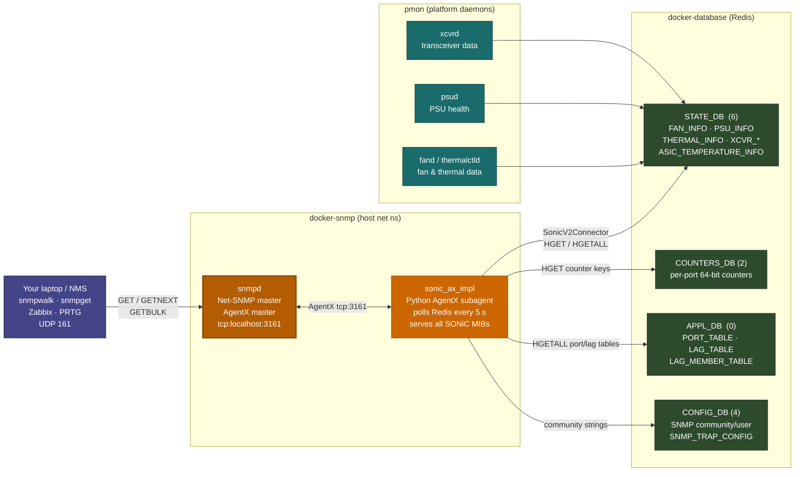

### 1.2 Request lifecycle — one GET from NMS to Redis

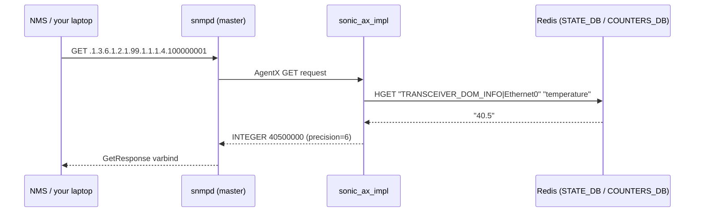

### 1.3 Code organisation — where to find things

```
sonic-snmpagent/
├── src/
│   ├── ax_interface/               # Generic AgentX protocol layer (not MIB-specific)
│   │   ├── agent.py                # Main event loop, AgentX socket management
│   │   ├── mib.py                  # MIBMeta metaclass, SubtreeMIBEntry, OidMIBEntry
│   │   └── encodings.py            # SNMP type encodings (Counter64, TimeTicks …)
│   └── sonic_ax_impl/
│       ├── main.py                 # Entry point — registers all MIBs with the agent
│       └── mibs/
│           └── ietf/
│               ├── rfc1213.py      # ← Interface MIB (MIB-II)          748 lines
│               ├── rfc2863.py      # ← Interface MIB (IF-MIB)          484 lines
│               ├── rfc2737.py      # ← Entity MIB                     1177 lines
│               ├── rfc3433.py      # ← Entity Sensor MIB               735 lines
│               ├── sensor_data.py  # Sensor value decode helpers        281 lines
│               └── physical_entity_sub_oid_generator.py  # Index math  181 lines
└── tests/
    ├── mock_tables/
    │   ├── dbconnector.py          # Patches swsscommon with JSON fixtures
    │   ├── state_db.json           # Fake STATE_DB (sensors, transceivers …)
    │   ├── counters_db.json        # Fake COUNTERS_DB (port counters)
    │   └── appl_db.json            # Fake APPL_DB (port/LAG tables)
    ├── test_rfc1213.py             # Unit tests for Interface MIB (MIB-II)
    ├── test_rfc2863.py             # Unit tests for Interface MIB (IF-MIB)
    ├── test_rfc2737.py             # Unit tests for Entity MIB
    ├── test_rfc3433.py             # Unit tests for Entity Sensor MIB
    ├── test_interfaces.py          # Integration-style interface counter tests
    ├── test_hc_interfaces.py       # HC (64-bit) counter tests
    └── test_sensor.py              # Sensor value / status tests
```

---

## 2. Quick-Start: Environment Setup

### 2.1 Configure SNMP community on the switch

Edit `/etc/sonic/config_db.json` (or use `sonic-cfggen`):

```json
{
    "SNMP": {
        "global": {
            "chassis_id": "Spectrum4-Switch01",
            "contact":    "ops@yourcompany.com",
            "location":   "Lab-Rack-01"
        }
    },
    "SNMP_COMMUNITY": {
        "public": { "name": "public", "vlan": "all" }
    }
}
```

```bash
sudo config reload -y
docker ps | grep snmp          # confirm container is running
```

### 2.2 Install test tools on your laptop

```bash
sudo apt-get install snmp snmp-mibs-downloader   # Ubuntu/Debian
pip install pysnmp pytest
```

### 2.3 Test connectivity

```bash
# From your laptop — replace with your switch management IP
snmpget -v2c -c public <SWITCH_IP> .1.3.6.1.2.1.1.1.0     # sysDescr

# From inside the switch (bypasses ACL/firewall — good for early debugging)
docker exec -it snmp snmpwalk -v2c -c public localhost .1.3.6.1.2.1.1
```

---

## 3. Interface MIB — RFC 1213 / RFC 2863

### 3.1 What is this MIB?

The Interface MIB answers: **"What ports does this switch have, what state are they in, and how much traffic is flowing?"**

It is split across two RFCs:
- **RFC 1213 (MIB-II `ifTable`)** — basic port metadata and 32-bit counters (`.1.3.6.1.2.1.2`)
- **RFC 2863 (IF-MIB `ifXTable`)** — extends ifTable with 64-bit counters, speed in Mbps, and trap control (`.1.3.6.1.2.1.31`)

> **IETF references**
> - RFC 1213: <https://www.rfc-editor.org/rfc/rfc1213>
> - RFC 2863: <https://www.rfc-editor.org/rfc/rfc2863>

### 3.2 Data flow for interface counters

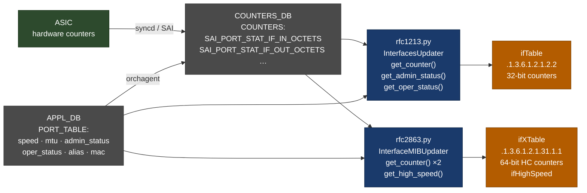

### 3.3 What is implemented today

| OID | Object | Value source in Redis | Status |
|---|---|---|---|
| `.2.2.1.2` | `ifDescr` | `APPL_DB PORT_TABLE:name` | ✅ |
| `.2.2.1.3` | `ifType` | Derived from interface name | ✅ |
| `.2.2.1.4` | `ifMtu` | `PORT_TABLE mtu` | ✅ |
| `.2.2.1.5` | `ifSpeed` | 32-bit — wraps above 4 Gbps | ✅ |
| `.2.2.1.6` | `ifPhysAddress` | `PORT_TABLE mac` | ✅ |
| `.2.2.1.7` | `ifAdminStatus` | `PORT_TABLE admin_status` | ✅ |
| `.2.2.1.8` | `ifOperStatus` | `PORT_TABLE oper_status` | ✅ |
| `.2.2.1.10`–`.21` | `ifIn/Out*` | `COUNTERS_DB` 32-bit | ✅ |
| `.31.1.1.1.6`–`.13` | `ifHCIn/OutOctets` etc. | `COUNTERS_DB` 64-bit | ✅ **use these for 100G+** |
| `.31.1.1.1.15` | `ifHighSpeed` | `PORT_TABLE speed` (Mbps) | ✅ |
| `.31.1.1.1.18` | `ifAlias` | `PORT_TABLE description` | ✅ |

### 3.4 Known gaps

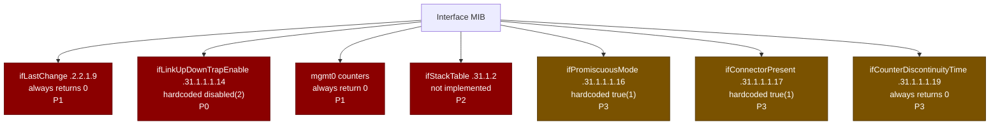

#### GAP-IF-01 — `ifLastChange` always 0

| | |
|---|---|
| **OID** | `.1.3.6.1.2.1.2.2.1.9` |
| **File** | `src/sonic_ax_impl/mibs/ietf/rfc1213.py` line 631 |
| **Current** | `lambda sub_id: 0` — hardcoded zero |
| **Expected** | `sysUpTime` at the moment `ifOperStatus` last changed |
| **Impact** | Cannot determine link uptime; SLA reporting broken |

```bash
# Reproduce: all interfaces return 0
snmpwalk -v2c -c public <SWITCH_IP> .1.3.6.1.2.1.2.2.1.9
```

```python
# rfc1213.py line 631 — the stub
# FIXME Placeholder.
ifLastChange = \
    SubtreeMIBEntry('2.1.9', if_updater, ValueType.TIME_TICKS, lambda sub_id: 0)
```

#### GAP-IF-02 — `ifLinkUpDownTrapEnable` hardcoded `disabled(2)`

| | |
|---|---|
| **OID** | `.1.3.6.1.2.1.31.1.1.1.14` |
| **File** | `src/sonic_ax_impl/mibs/ietf/rfc2863.py` line 432 |
| **Current** | `lambda sub_id: 2` — always disabled |
| **Expected** | Configurable per-interface; physical ports default `enabled(1)` |
| **Impact** | linkUp/linkDown traps never fire — NMS is blind to port state changes |

```bash
# Reproduce: all interfaces return INTEGER: 2
snmpwalk -v2c -c public <SWITCH_IP> .1.3.6.1.2.1.31.1.1.1.14
```

#### GAP-IF-03 — Management interface counters always 0

| | |
|---|---|
| **OID** | All counter OIDs for the `mgmt0` / `eth0` interface |
| **File** | `src/sonic_ax_impl/mibs/ietf/rfc1213.py` lines 395–399 |
| **Current** | Short-circuits to `return 0` for any `mgmt_oid_name_map` entry |
| **Expected** | Real counters from `/sys/class/net/<iface>/statistics/` |
| **Impact** | Management port bandwidth invisible to NMS |

```bash
# Find mgmt0 ifIndex
snmpwalk -v2c -c public <SWITCH_IP> .1.3.6.1.2.1.2.2.1.2 | grep -i eth
# Walk its counters — all return 0
snmpwalk -v2c -c public <SWITCH_IP> .1.3.6.1.2.1.2.2.1.10
```

#### GAP-IF-04 — `ifStackTable` not implemented

| | |
|---|---|
| **OID** | `.1.3.6.1.2.1.31.1.2` |
| **Impact** | LAG topology (PortChannel → member Ethernet ports) invisible via SNMP |

```bash
snmpwalk -v2c -c public <SWITCH_IP> .1.3.6.1.2.1.31.1.2
# Returns nothing
```

### 3.5 Development files

| File | Purpose |
|---|---|
| `src/sonic_ax_impl/mibs/ietf/rfc1213.py` | `InterfacesUpdater` — reads `APPL_DB` + `COUNTERS_DB`; defines `ifTable` OIDs |
| `src/sonic_ax_impl/mibs/ietf/rfc2863.py` | `InterfaceMIBUpdater` — extends with `ifXTable` (HC counters, `ifHighSpeed`, trap enable) |

### 3.6 Test files

| File | What it covers |
|---|---|
| `tests/test_rfc1213.py` | `InterfacesUpdater` init, counter reads, Redis error handling |
| `tests/test_rfc2863.py` | `InterfaceMIBUpdater` speed, HC counter reads |
| `tests/test_interfaces.py` | End-to-end interface counter values via mock DB |
| `tests/test_hc_interfaces.py` | 64-bit counter correctness |
| `tests/mock_tables/counters_db.json` | Mock COUNTERS_DB fixtures used by all interface tests |
| `tests/mock_tables/appl_db.json` | Mock PORT_TABLE / LAG_TABLE fixtures |

```bash
# Run interface MIB tests only
pytest tests/test_rfc1213.py tests/test_rfc2863.py tests/test_interfaces.py tests/test_hc_interfaces.py -v
```

---

## 4. Entity MIB — RFC 2737

### 4.1 What is this MIB?

The Entity MIB answers: **"What physical hardware is installed in this switch, and how is it organised?"**

It exposes a tree of every physical component — chassis, fan drawers, fans, PSUs, transceivers, sensors, and line cards — as rows in `entPhysicalTable`. Each row has columns for description, serial number, model, firmware version, and its parent-child relationship.

> **IETF references**
> - RFC 2737: <https://www.rfc-editor.org/rfc/rfc2737>
> - RFC 4133 (update): <https://www.rfc-editor.org/rfc/rfc4133>

**UpscaleAI vendor OID root (PEN 64820):**  
`1.3.6.1.4.1.64820` — used in `entPhysicalVendorType` to identify UpscaleAI hardware parts.

### 4.2 Physical entity tree

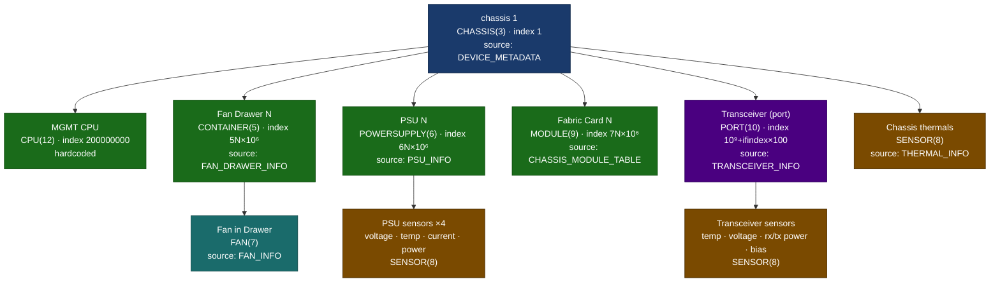

### 4.3 OID index scheme

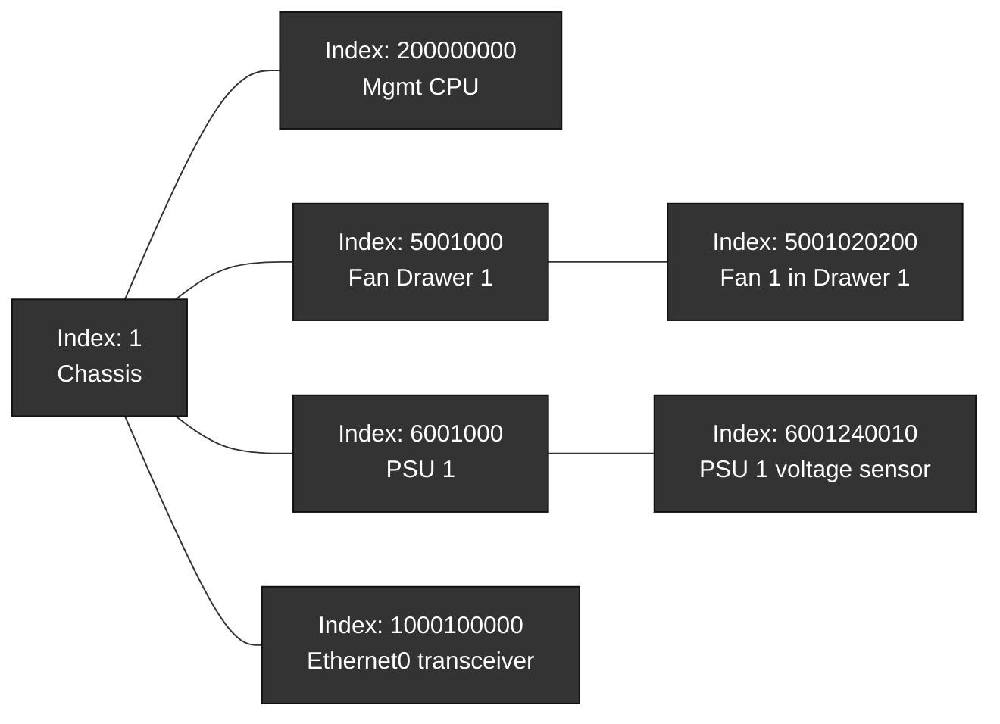

> The index math lives in `src/sonic_ax_impl/mibs/ietf/physical_entity_sub_oid_generator.py`.
> Every 9-digit index encodes: **module type (1 digit) · module index (2) · device type (2) · device index (2) · sensor type (1) · sensor index (1)**.

### 4.4 What is implemented today

| OID suffix | Object | Value source | Status |
|---|---|---|---|
| `1.1.1.2` | `entPhysicalDescr` | DB key description | ✅ |
| `1.1.1.3` | `entPhysicalVendorType` | **Always empty** — PEN 64820 not wired | ❌ GAP |
| `1.1.1.4` | `entPhysicalContainedIn` | Parent index from name→OID map | ✅ |
| `1.1.1.5` | `entPhysicalClass` | chassis/fan/sensor/module/port enum | ✅ |
| `1.1.1.6` | `entPhysicalParentRelPos` | Slot position | ✅ |
| `1.1.1.7` | `entPhysicalName` | DB key name | ✅ |
| `1.1.1.8` | `entPhysicalHardwareVersion` | `vendor_rev` from TRANSCEIVER_INFO | ✅ |
| `1.1.1.9` | `entPhysicalFirmwareVersion` | **Always empty** | ❌ GAP |
| `1.1.1.10` | `entPhysicalSoftwareRevision` | **Always empty** | ❌ GAP |
| `1.1.1.11` | `entPhysicalSerialNumber` | PSU / FAN / XCVR info | ✅ |
| `1.1.1.12` | `entPhysicalMfgName` | Manufacturer | ✅ |
| `1.1.1.13` | `entPhysicalModelName` | Part number / model | ✅ |
| `1.1.1.14` | `entPhysicalAlias` | **Always empty** | ⚠️ |
| `1.1.1.15` | `entPhysicalAssetID` | **Always empty** | ⚠️ |
| `1.1.1.16` | `entPhysicalIsFRU` | `is_replaceable` field | ✅ |
| `1.3.3` | `entPhysicalContainsTable` | **Not implemented** | ❌ GAP |
| `1.2` | `entLogicalTable` | **Not implemented** | ❌ GAP |

### 4.5 Known gaps

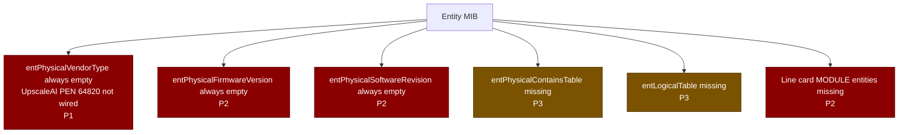

#### GAP-ENT-01 — `entPhysicalVendorType` empty (UpscaleAI PEN 64820 not populated)

| | |
|---|---|
| **OID** | `.1.3.6.1.2.1.47.1.1.1.1.3` |
| **File** | `src/sonic_ax_impl/mibs/ietf/rfc2737.py` — `get_phy_vendor_type()` |
| **Expected** | OID string from `1.3.6.1.4.1.64820.1.1.4.*` per component type |
| **Impact** | NMS cannot identify UpscaleAI-specific hardware parts |

```bash
snmpwalk -v2c -c public <SWITCH_IP> .1.3.6.1.2.1.47.1.1.1.1.3
# All rows return empty string — should return 1.3.6.1.4.1.64820.1.1.4.x
```

**Fix direction:** Platform daemons must write the OID string into Redis (e.g. `TRANSCEIVER_INFO|EthernetN vendor_type`). The `get_phy_vendor_type()` method then reads it instead of always returning `""`.

#### GAP-ENT-02 — `entPhysicalFirmwareVersion` always empty

| | |
|---|---|
| **OID** | `.1.3.6.1.2.1.47.1.1.1.1.9` |
| **File** | `src/sonic_ax_impl/mibs/ietf/rfc2737.py` — `get_phy_fw_ver()` |

```bash
snmpwalk -v2c -c public <SWITCH_IP> .1.3.6.1.2.1.47.1.1.1.1.9
# All empty — cross-check what is in Redis:
docker exec -it database redis-cli -n 6 HGET "TRANSCEIVER_INFO|Ethernet0" "firmware_version"
docker exec -it database redis-cli -n 6 HGET "PSU_INFO|PSU 1" "firmware_version"
```

#### GAP-ENT-03 — Line card MODULE entities missing

| | |
|---|---|
| **Impact** | Modular chassis physical inventory incomplete — line cards absent from SNMP entity tree |

```bash
# Count MODULE(9) entries — only fabric cards appear, no line cards
snmpwalk -v2c -c public <SWITCH_IP> .1.3.6.1.2.1.47.1.1.1.1.5 | grep " INTEGER: 9$"
```

### 4.6 Development files

| File | Purpose |
|---|---|
| `src/sonic_ax_impl/mibs/ietf/rfc2737.py` | All entity updater classes (`XcvrCacheUpdater`, `PsuCacheUpdater`, `FanCacheUpdater`, `ThermalCacheUpdater`, `FabricCardCacheUpdater`) and the MIB class |
| `src/sonic_ax_impl/mibs/ietf/physical_entity_sub_oid_generator.py` | Index arithmetic — how a fan/PSU/transceiver gets its `entPhysicalIndex` |

### 4.7 Test files

| File | What it covers |
|---|---|
| `tests/test_rfc2737.py` | `PhysicalTableMIBUpdater` init, exception handling during `reinit_data`, fabric card updater |
| `tests/test_psu.py` | PSU entity and sensor data reads |
| `tests/test_sensor.py` | Sensor entity field reads |
| `tests/mock_tables/state_db.json` | Mock `PSU_INFO`, `FAN_INFO`, `THERMAL_INFO`, `TRANSCEIVER_INFO` fixtures |

```bash
pytest tests/test_rfc2737.py tests/test_psu.py tests/test_sensor.py -v
```

---

## 5. Entity Sensor MIB — RFC 3433

### 5.1 What is this MIB?

The Entity Sensor MIB answers: **"What are the current readings for every sensor in the physical inventory?"**

It is an extension of Entity MIB. Every `SENSOR(8)` row in `entPhysicalTable` (RFC 2737) has a corresponding row in `entPhySensorTable` (RFC 3433) that gives the **live numeric reading** — temperature, voltage, current, power, or fan speed.

> **IETF reference**
> - RFC 3433: <https://www.rfc-editor.org/rfc/rfc3433>

### 5.2 How sensor readings are encoded

SNMP can only carry integers. Sensors use a **type + scale + precision** triple to encode floats:

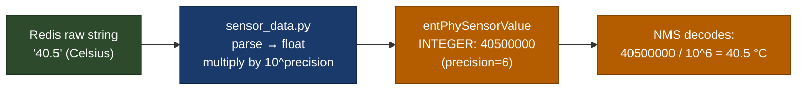

**Sensor type reference:**

| Type int | Meaning | Scale | Precision | Example raw → decoded |
|---|---|---|---|---|
| 4 | VOLTS_DC | UNITS(9) | 4 | `33000 → 3.3 V` |
| 5 | AMPERES | UNITS(9) | 3 | `5000 → 5.0 A` |
| 6 | WATTS | UNITS(9) | 3 | `60000 → 60 W` |
| 8 | CELSIUS | UNITS(9) | 6 (xcvr) / 3 (PSU/thermal) | `40500000 → 40.5 °C` |
| 10 | RPM | UNITS(9) | 0 | `3600 → 3600 RPM` |

### 5.3 Sensor sources in Redis

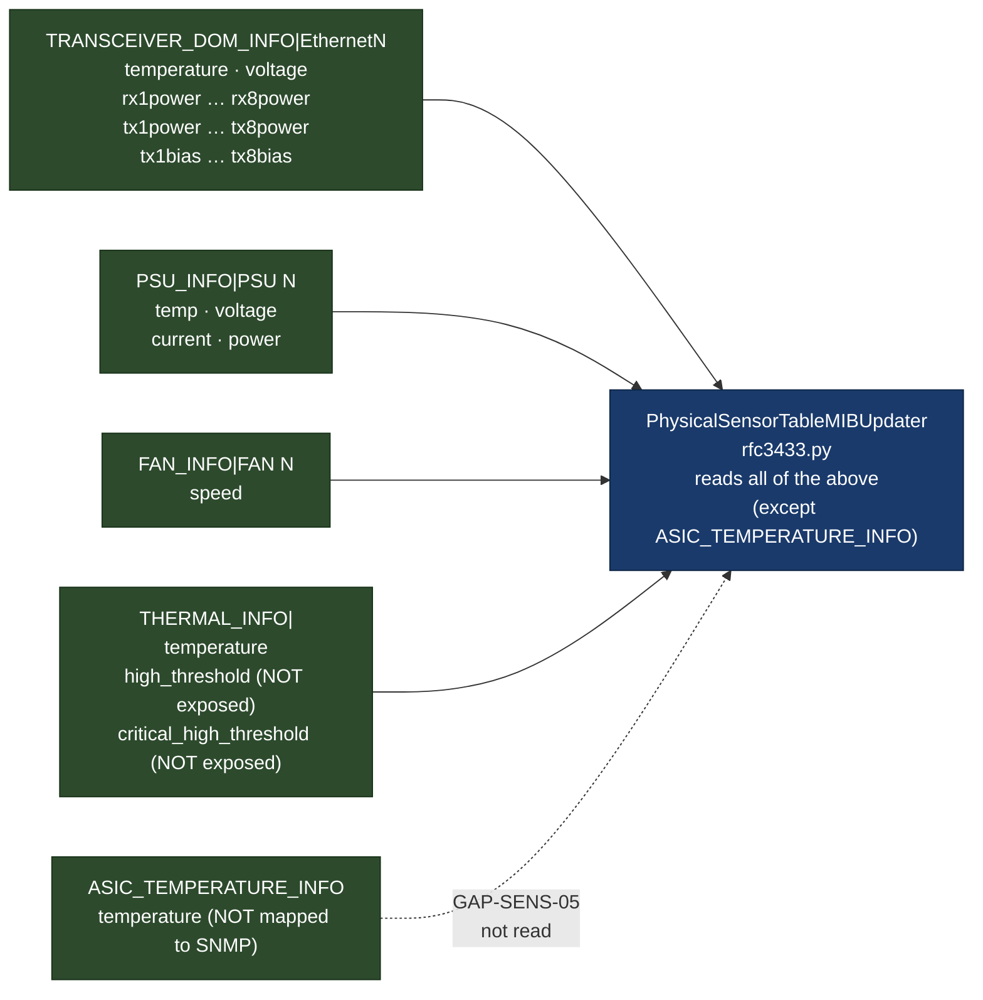

### 5.4 What is implemented today

| OID suffix | Object | Status |
|---|---|---|
| `1.1.1.1` | `entPhySensorType` | ✅ |
| `1.1.1.2` | `entPhySensorScale` | ✅ |
| `1.1.1.3` | `entPhySensorPrecision` | ✅ |
| `1.1.1.4` | `entPhySensorValue` | ✅ |
| `1.1.1.5` | `entPhySensorOperStatus` | ✅ `ok(1)` / `unavailable(2)` |
| `1.1.1.6` | `entPhySensorUnitsDisplay` | ❌ GAP |
| `1.1.1.7` | `entPhySensorValueTimeStamp` | ❌ GAP |
| `1.1.1.8` | `entPhySensorValueUpdateRate` | ❌ GAP |
| `1.1.2` | `entSensorThresholdTable` | ❌ GAP |

### 5.5 Known gaps

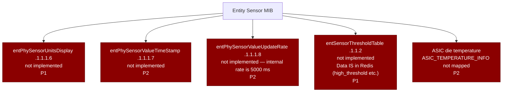

#### GAP-SENS-01 — `entPhySensorUnitsDisplay` not implemented

| | |
|---|---|
| **OID** | `.1.3.6.1.2.1.99.1.1.1.6` |
| **Expected** | Human-readable string: `"Celsius"`, `"Volts DC"`, `"Watts"`, `"rpm"` |
| **Impact** | Generic NMS dashboards must hardcode unit strings per sensor type |

```bash
snmpwalk -v2c -c public <SWITCH_IP> .1.3.6.1.2.1.99.1.1.1.6
# Returns nothing — entire subtree absent
```

#### GAP-SENS-04 — `entSensorThresholdTable` not implemented

| | |
|---|---|
| **OID** | `.1.3.6.1.2.1.99.1.1.2` |
| **Expected** | High/low/critical threshold per sensor |
| **Impact** | Threshold-based alerting requires platform-specific tooling instead of standard SNMP |

```bash
snmpwalk -v2c -c public <SWITCH_IP> .1.3.6.1.2.1.99.1.1.2
# Returns nothing

# But the data IS in Redis — just not wired into SNMP yet
docker exec -it database redis-cli -n 6 HGET "THERMAL_INFO|ASIC" "high_threshold"
docker exec -it database redis-cli -n 6 HGET "THERMAL_INFO|ASIC" "critical_high_threshold"
docker exec -it database redis-cli -n 6 HGET "PSU_INFO|PSU 1" "temp_threshold"
```

#### GAP-SENS-05 — ASIC die temperature not mapped

| | |
|---|---|
| **Source** | `ASIC_TEMPERATURE_INFO` in `STATE_DB` |
| **Impact** | Spectrum-4 die temperature — often the earliest thermal runaway indicator — invisible to NMS |

```bash
# Verify data exists in Redis
docker exec -it database redis-cli -n 6 HGETALL "ASIC_TEMPERATURE_INFO"

# Confirm it does NOT appear in SNMP
snmpwalk -v2c -c public <SWITCH_IP> .1.3.6.1.2.1.47.1.1.1.1.2 | grep -i asic
```

### 5.6 Development files

| File | Purpose |
|---|---|
| `src/sonic_ax_impl/mibs/ietf/rfc3433.py` | `PhysicalSensorTableMIBUpdater` + `PhysicalSensorTableMIB` — all sensor OID registrations |
| `src/sonic_ax_impl/mibs/ietf/sensor_data.py` | `BaseSensorData` + per-type classes — parse raw Redis strings, apply type/scale/precision |
| `src/sonic_ax_impl/mibs/ietf/physical_entity_sub_oid_generator.py` | Sensor index constants (`SENSOR_TYPE_TEMP`, `SENSOR_TYPE_FAN` …) |

### 5.7 Test files

| File | What it covers |
|---|---|
| `tests/test_rfc3433.py` | `PhysicalSensorTableMIBUpdater` init, missing transceiver info, Redis error, fabric card fan sensors |
| `tests/test_sensor.py` | Sensor value and status reads via mock DB |
| `tests/namespace/test_sensor.py` | Same tests in a multi-ASIC namespace context |
| `tests/mock_tables/state_db.json` | Mock `TRANSCEIVER_DOM_INFO`, `PSU_INFO`, `FAN_INFO`, `THERMAL_INFO` fixtures |

```bash
pytest tests/test_rfc3433.py tests/test_sensor.py -v
```

---

## 6. Running the Existing Unit Tests

The test suite mocks Redis using JSON fixture files — no switch hardware needed.

```bash
cd sonic-snmpagent

# Install dependencies
pip install -e ".[testing]"

# Run all tests
pytest tests/ -v

# Run only the three MIB-specific test files
pytest tests/test_rfc1213.py tests/test_rfc2863.py \
       tests/test_rfc2737.py \
       tests/test_rfc3433.py -v

# Run with coverage
pytest tests/ --cov=src/sonic_ax_impl --cov-report=term-missing
```

### Test structure pattern

Every test follows the same mock pattern. Here is how to read it:

```python
# tests/test_rfc3433.py — annotated for newcomers

from unittest import TestCase
from unittest import mock
from sonic_ax_impl.mibs.ietf.rfc3433 import PhysicalSensorTableMIBUpdater

class TestPhysicalSensorTableMIBUpdater(TestCase):

    # 1. @mock.patch replaces a real Redis call with a return value from a JSON fixture
    @mock.patch('sonic_ax_impl.mibs.Namespace.dbs_get_all',
                mock.MagicMock(return_value=({"hardwarerev": "1.0"})))
    def test_PhysicalSensorTableMIBUpdater_transceiver_info_key_missing(self):

        # 2. Create the updater — this triggers __init__ which calls reinit_data
        updater = PhysicalSensorTableMIBUpdater()
        updater.transceiver_dom.append("TRANSCEIVER_INFO|Ethernet0")

        # 3. Exercise the code under test
        with mock.patch('sonic_ax_impl.mibs.logger.warn') as mocked_warn:
            updater.update_data()
            mocked_warn.assert_called()      # 4. Assert expected side effects

        self.assertTrue(len(updater.sub_ids) == 0)  # 5. Assert state
```

---

## 7. How to Fill a Gap — Contributor Workflow

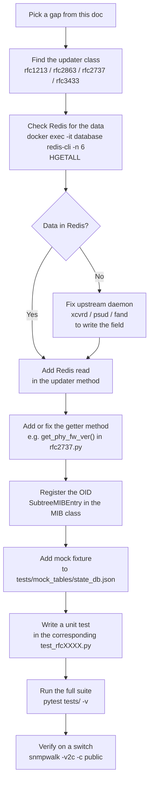

### Example: adding `entPhySensorUnitsDisplay` (GAP-SENS-01)

**Step 1** — Add a getter in `PhysicalSensorTableMIBUpdater` (`rfc3433.py`):

```python
def get_ent_physical_sensor_units_display(self, sub_id):
    """Return a human-readable unit string for this sensor."""
    if sub_id not in self.sub_ids:
        return None
    sensor_type = self.ent_phy_sensor_type_map.get(sub_id)
    units_map = {
        EntitySensorDataType.CELSIUS:  "Celsius",
        EntitySensorDataType.VOLTS_DC: "Volts DC",
        EntitySensorDataType.AMPERES:  "Amperes",
        EntitySensorDataType.WATTS:    "Watts",
        EntitySensorDataType.RPM:      "rpm",
    }
    return units_map.get(sensor_type, "")
```

**Step 2** — Register the OID in `PhysicalSensorTableMIB` (`rfc3433.py`):

```python
entPhySensorUnitsDisplay = \
    SubtreeMIBEntry('1.6', updater, ValueType.OCTET_STRING,
                    updater.get_ent_physical_sensor_units_display)
```

**Step 3** — Add a unit test (`tests/test_rfc3433.py`):

```python
def test_sensor_units_display_celsius(self):
    updater = PhysicalSensorTableMIBUpdater()
    # inject a known sensor sub_id and type
    updater.sub_ids = {100000001}
    updater.ent_phy_sensor_type_map = {100000001: EntitySensorDataType.CELSIUS}
    result = updater.get_ent_physical_sensor_units_display(100000001)
    self.assertEqual(result, "Celsius")
```

**Step 4** — Run and verify:

```bash
pytest tests/test_rfc3433.py -v
docker exec -it snmp snmpwalk -v2c -c public localhost .1.3.6.1.2.1.99.1.1.1.6
```

---

*Analysis based on commit `6bc7412` · Branch `thongal_nms_compliance1` · UpscaleAI PEN `64820`*
